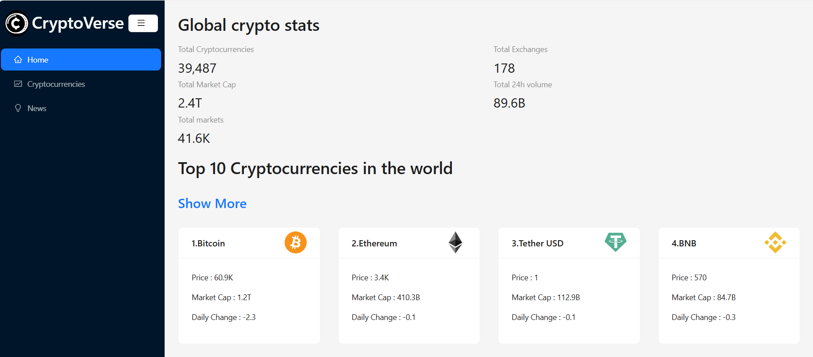

# CryptoVerse App



CryptoVerse is a web application that provides users with the real time cryptocurrency data  market trends  and detailed information about various cryptocurrencies 

## Features 
 
- **Real-time data** : Displays upto date cryptocurrency prices and market data.
- **Detailed information** : Provides in-depth information on individual cryptocurrencies .
- **Market trends** : Displays trends and latest news of various cryptocurrencies

## Technologies used 
 
 - Frontend : ReactJS  , Redux   , HTML  , CSS , Javascript
 - CoinRanking API 

## Project SetUp

1. **Clone the Repository:**

   ```
   git clone repository_url_here
   ```
   
2. **Navigate to the Project Directory:**

   ```
   cd cryptoverseapp
   ```
   
3. **Install  Dependencies:**

   ```
   npm install
   ```

5. **Configure Environment Variables:**

   ```
   Create a .env file and add API key here 
   ```
   
6. **Start the  Development Server:**

   ```
   npm run start
   ```


   

